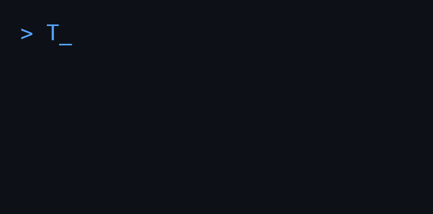

<div align="center">
  <!-- 위에서 생성된 GIF의 경로를 저장소 환경에 맞게 수정해주세요 -->
  

  # ThearKANBAN (MNDK)
  **Markdown-Native Discord Kanban**

  <p align="center">
    
    
    
    
  </p>

  <p><em>Seamless collaboration between Human and Multi-AI agents via Context-as-code</em></p>
</div>

---

## 1. Project Objective & Core Philosophy

- **Goal:** Create a Markdown-backed Kanban system that allows seamless, simultaneous collaboration between non-developer humans (via Web GUI & Discord) and Multi-AI agents (via API/Local File).
- **Core Philosophy (Context-as-code):** The Single Source of Truth (SSOT) is strictly Markdown files (`.md`) with YAML Frontmatter. No external databases (SQL/NoSQL) are allowed for task state management.
- **Inspiration:** Inherits the VS Code compatibility of *Kanban Markdown* and the AI-native MCP/CLI architecture of *kanban-lite*.

## 2. Target Interfaces

1. **Web Dashboard:** For non-developers (GUI drag-and-drop, served directly by the backend).
2. **Discord Bot & CLI:** For immediate task creation/updates via slash commands, mapping directly to CLI commands.
3. **Local IDE (VS Code / Obsidian):** Direct Markdown editing for developers. (Maintains standard YAML frontmatter schema to support existing VS Code Kanban extensions).
4. **AI Agents (REST API & MCP):** Real-time context parsing via REST API and Model Context Protocol (MCP) for native AI agent integration (e.g., Claude, OpenClaw).

## 3. Tech Stack Requirements

- **Backend:** Node.js (TypeScript), Express / Fastify, `@modelcontextprotocol/sdk` (for MCP).
- **Storage / File System:** `gray-matter` (YAML parsing), `chokidar` (File watcher).
- **Frontend:** React (Vite), TailwindCSS, `dnd-kit` (for Kanban drag & drop).
- **Discord Integration:** `discord.js`.
- **CLI Wrapper:** `commander` or `yargs`.
- **Concurrency Handling:** `async-mutex` or `proper-lockfile` (**CRITICAL**).

## 4. System Architecture & Data Flow

**Directory Structure:** All tasks reside in a specific folder (e.g., `./data/tasks/`).

**Task Format (`.md`):** Must be fully compatible with standard Obsidian/VS Code Kanban frontmatter.
```yaml
---
id: "TASK-123"
title: "Community Member A Follow-up"
status: "In Progress"
assignee: "Morpheus"
dueDate: "2026-08-15"
---
Consulting history and notes go here...